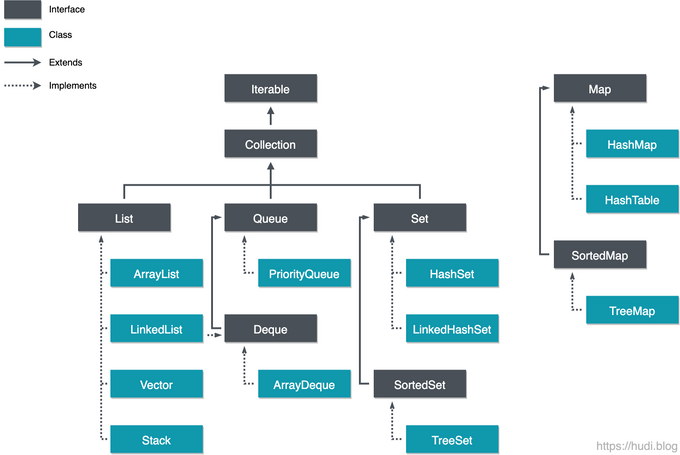

### **Java Collection Framework 의 개요**

-   다수의 데이터를 쉽고 효과적으로 처리할 수 있는 표준화된 방법을 제공하는 클래스의 집합

#### **특징**

-   배열과 달리 가변적인 크기를 가짐
-   데이터 삽입, 탐색, 정렬 등 편리한 API 제공
-   List, Queue, Set, Map 등의 인터페이스를 제공, 이를 통해 일관된 API를 사용할 수 있음

#### **계층 및 종류**

-   리스트 (List) : 인덱스 순서로 요소를 저장. 중복된 데이터를 저장할 수 있음.
-   큐 (Queue) : 데이터가 저장된 순서대로 출력되는 선입선출 (FIFO: First In First Out) 의 구조를 갖는 선형 자료구조이다.
-   집합 (Set) : 순서가 없고, 데이터를 중복하여 저장할 수 없음. 집합 연산 (합집합, 교집합, 차집합 등) 을 지원.
-   맵 (Map) : Key-value 쌍으로 데이터를 저장. 순서가 없고, Key 가 중복될 수 없음.

Collection 인터페이스는 Iterable 이라는 인터페이스를 상속하고 있다.

### **Iterable 인터페이스**

> Implementing this interface allows an object to be the target of the "for-each loop" statement. See For-each Loop

문서에서는 for-each 루프의 대상이 될 수 있는 객체를 표현한 것이라고 설명한다.

#### **주요 메서드**

-   iterator() : Iterator 타입 객체 반환
-   forEach(Consumer action) : Iterable의 각 요소에 대해 지정된 작업을 수행
-   spliterator()

이 인터페이스를 상속하는 객체들이 iterator 메서드를 구현하도록 강제한다. 다시 말해 모든 Collection 타입의 객체들 은 iterator()를 구현해야 한다.

### **Iterator 인터페이스**

-   Collection에 저장된 요소를 읽어오는 것을 표준화한 인터페이스

#### **주요 메서드**

-   hasNext() : 다음 원소 존재 여부 반환
-   next() : 다음 원소 반환
-   remove() : 해당 컬렉션에서 마지막으로 반환한 원소를 삭제

### **참고 자료**

-   [https://youtu.be/iJn1NLVw6FQ](https://youtu.be/iJn1NLVw6FQ)
-   [https://hudi.blog/java-collection-framework-1/](https://hudi.blog/java-collection-framework-1/)
-   [https://girawhale.tistory.com/17](https://girawhale.tistory.com/17)